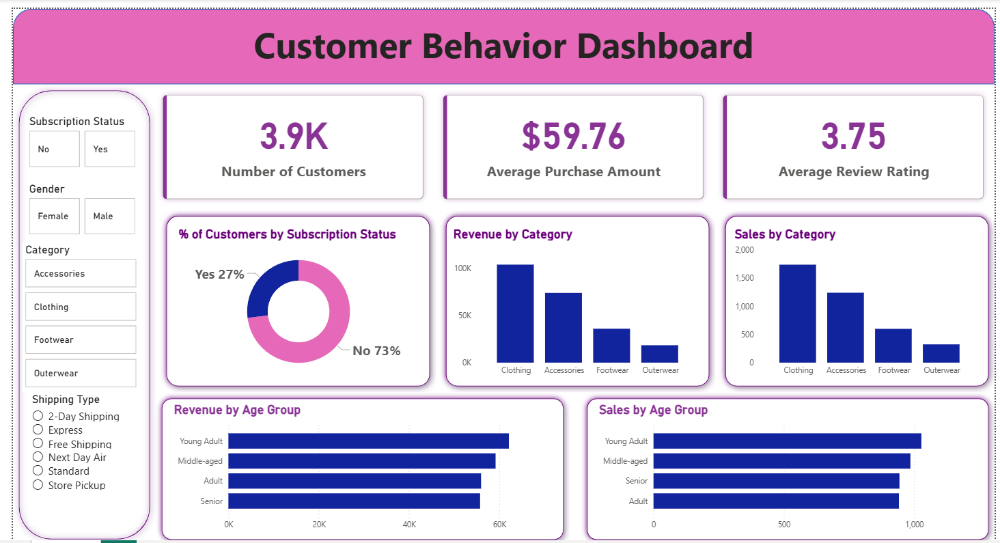
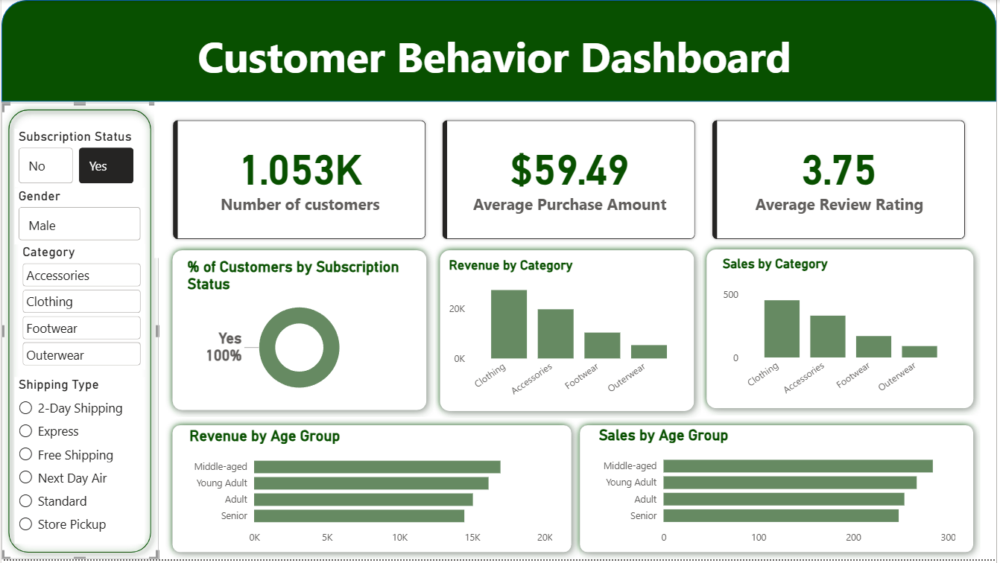
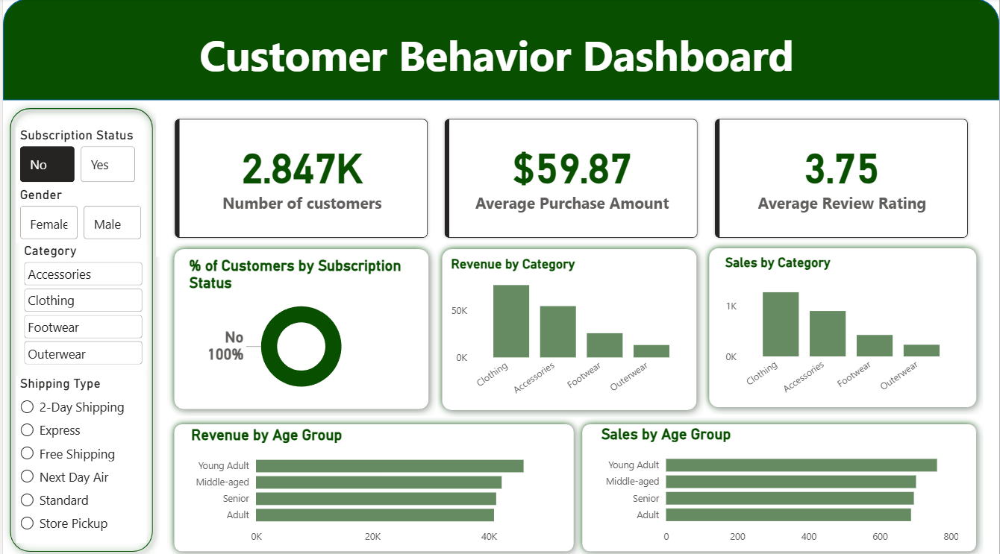

# Customer Purchase Behavior Analysis

## Overview

This project demonstrates an end-to-end *Data Analytics workflow* using *Python, SQL, and Power BI* to analyze customer purchasing behavior and generate actionable business insights. The analysis focuses on identifying purchasing patterns, product performance, subscription trends, and revenue drivers through data-driven decision-making.

## Dashboard Overview

  
 
  

## Objectives

* Analyze customer demographics and purchasing behavior.
* Identify top-performing products and categories.
* Evaluate subscription conversion trends.
* Develop interactive dashboards for business reporting.
* Generate insights to support strategic decision-making.

## Dataset

The dataset contains *3,900+ customer records* with information related to:

* Customer Demographics
* Product Categories
* Purchase History
* Subscription Status
* Sales & Revenue Metrics

## Tech Stack

*Programming & Analysis:* Python, Pandas, NumPy

*Visualization:* Matplotlib, Seaborn, Power BI

*Database:* SQL (PostgreSQL/MySQL)

*Tools:* Jupyter Notebook, Git, GitHub

## Project Workflow

### 1. Data Cleaning & Preparation

* Handled missing values and duplicate records.
* Standardized data formats and validated data quality.
* Prepared the dataset for analysis and reporting.

### 2. Exploratory Data Analysis (EDA)

* Analyzed customer demographics and spending behavior.
* Identified purchasing trends and category performance.
* Created visualizations to uncover business patterns.

### 3. SQL Analysis

* Developed SQL queries using joins, aggregations, CTEs, and window functions.
* Analyzed customer behavior, sales trends, and subscription metrics.
* Extracted business insights from structured datasets.

### 4. Power BI Dashboard

* Built an interactive dashboard with 10+ KPIs.
* Visualized revenue trends, customer segments, and product performance.
* Added filters and drill-down capabilities for dynamic analysis.

## Dashboard Highlights

* Customer Segmentation Analysis
* Revenue & Sales Trends
* Product Performance Tracking
* Subscription Status Analysis
* Category-wise Purchase Analysis
* Interactive Filters & Slicers

## Key Insights

* Identified top-performing product categories contributing most to revenue.
* Analyzed customer purchasing patterns and spending behavior.
* Evaluated subscription conversion rates across customer segments.
* Generated recommendations to improve customer engagement and business performance.

## Repository Structure

text
Customer-Purchase-Behavior-Analysis/
│
├── data/
├── notebooks/
├── sql/
├── dashboard/
├── reports/
└── README.md

## Results

This project showcases how *Python, SQL, and Power BI* can be combined to transform raw customer data into meaningful insights, interactive dashboards, and business recommendations that support data-driven decision-making.